# gymdiary-app-backend

# app.js

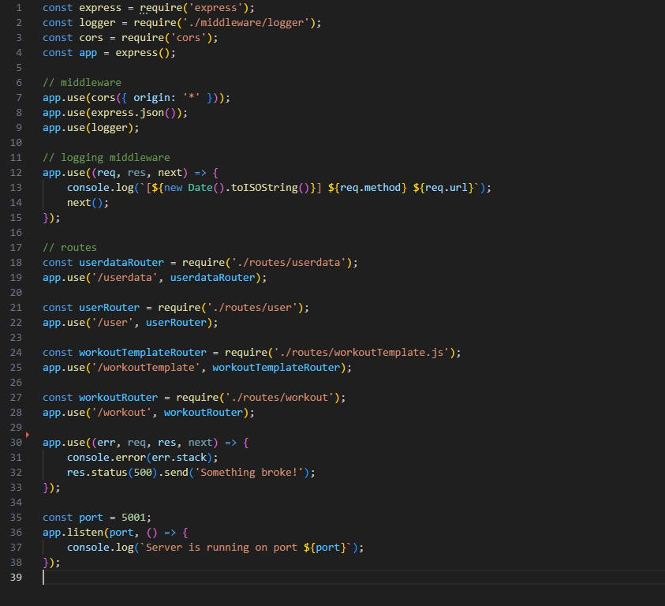

Pakettien käyttöönotto, middlewaret, routet osoitetaan vastaavaan routetiedostoon, error handling ja serverin käynnistys.

# Routet

## Route tiedostot
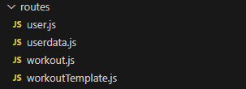

Routes tiedosto

## Käyttäjä routet
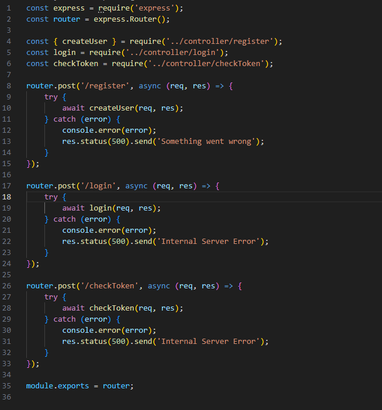

Käyttäjä routet

## Harjoite routet
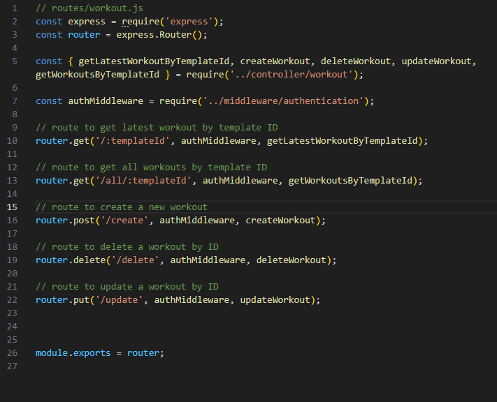

Harjoite routet

## Harjoitepohjien routet
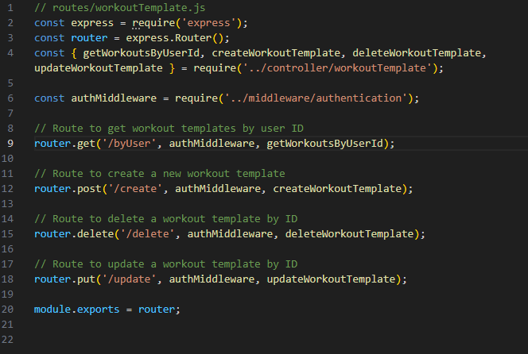

Harjoitepohjien routet

# Mallit

## Käyttäjä malli

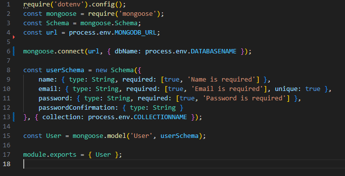

Käyttäjä malli

## Harjoite malli

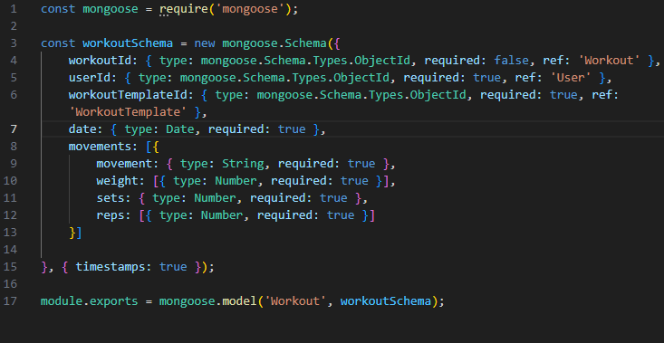

Harjoite malli

## Harjoitepohja malli

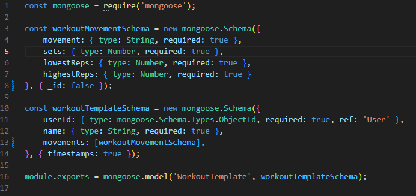

Harjoitepohja malli

# Middlewaret

## Autentikaatio

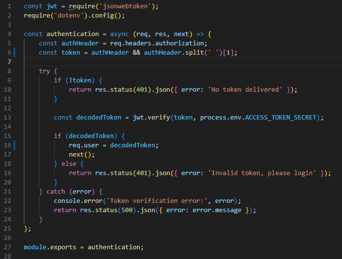

Autentikaatio toteutettiin jsonwebtokenilla

## Logger

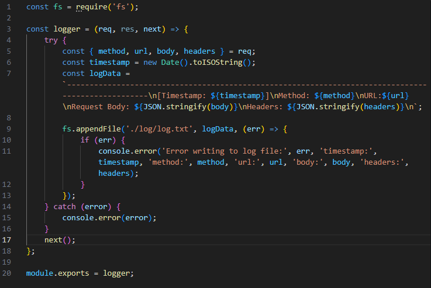

Itsetehty logger, joka tallentaa tekstitiedostoon tapahtumia

# Controllerit

## checkToken controller

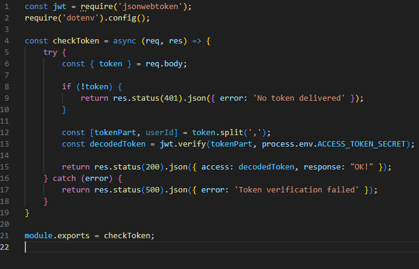

Controlleri tarkistaa että lähetetty tokeni on validi

## login controller

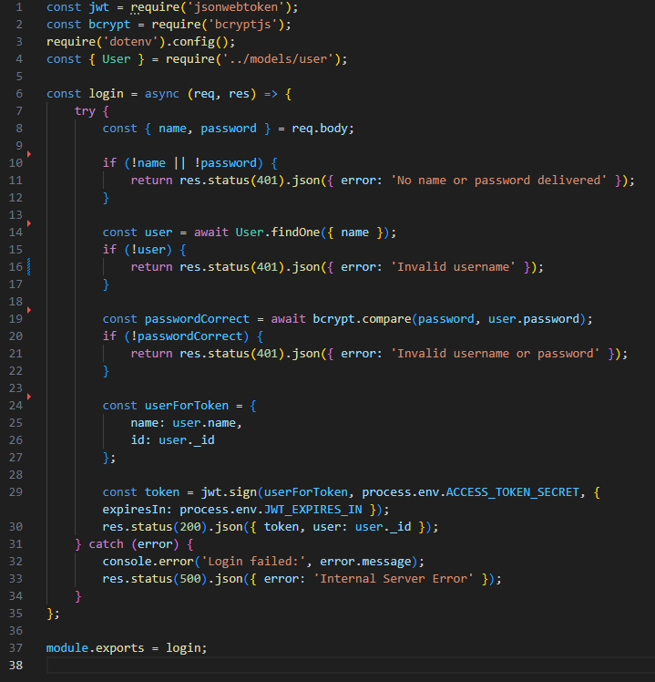

Controlleri toimii vaiheittain:
1. Tarkistaa saapuiko nimi ja salasana
2. Etsii onko käyttäjänimellä käyttäjää tietokannassa
3. Tarkistaa vastaako salasana
4. Luo ja allekirjoittaa tokenin käyttäjälle
5. Vastaa pyyntöön

Missä tahansa virhetilanteessa controlleri vastaa etupuolelle halutulla tavalla

## register controller

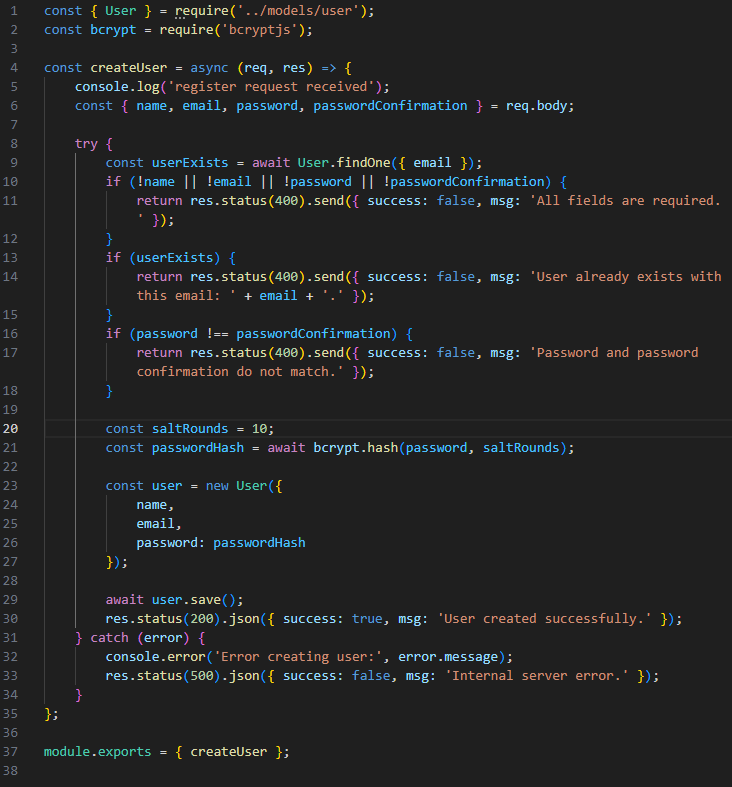

Controlleri toimii vaiheittain:
1. Tarkistaa saapuiko tarvittavat tiedot
2. Tarkistaa ettei käyttäjää ole samalla sähköpostilla jo
3. Tarkistaa että salasana ja salasanan vahvistus ovat samat
4. Hajauttaa salasanan
5. Luo käyttäjän
5. Tallentaa käyttäjän

Missä tahansa virhetilanteessa controlleri vastaa etupuolelle halutulla tavalla

## harjoite controller 

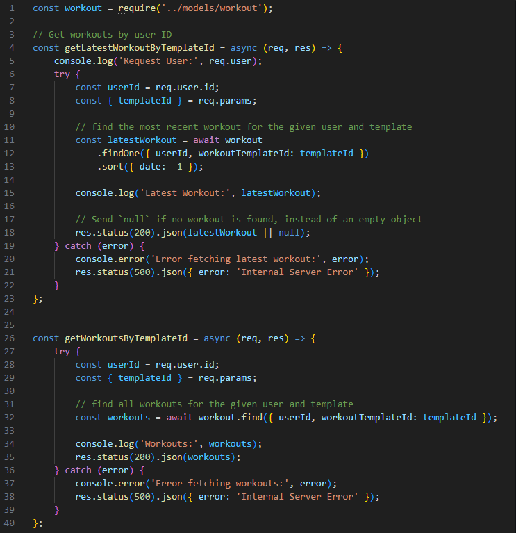

getLatestWorkoutTemplateId-funktiota käytetään edellisen harjoitekerran tulosten hakemista varten.

getWorkoutsByTemplateId-funktiota käytetään kaikkien harjoitteiden hakuun tietyn harjoitepohjan mukaan

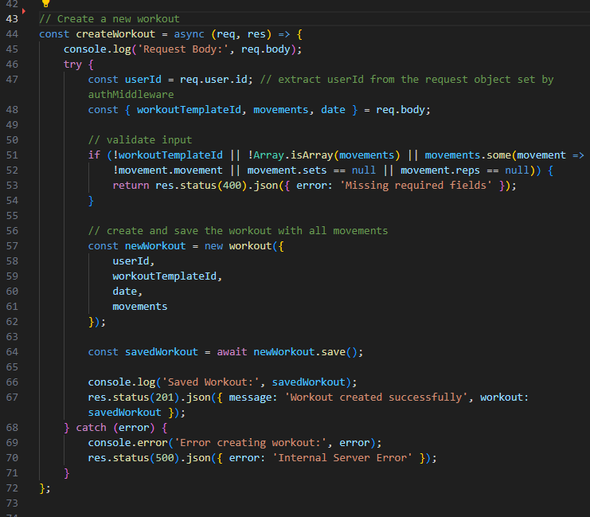

createWorkout-funktio luo uuden tehdyn harjoitteen saatujen tietojen perusteella

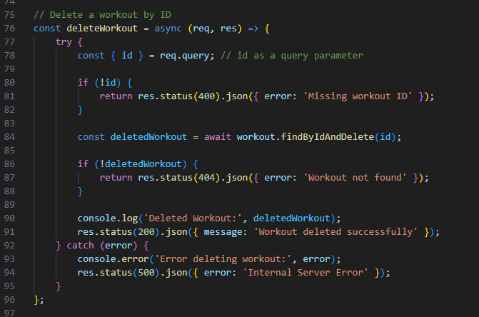

deleteWorkout-funktio poistaa tehdyn harjoitteen

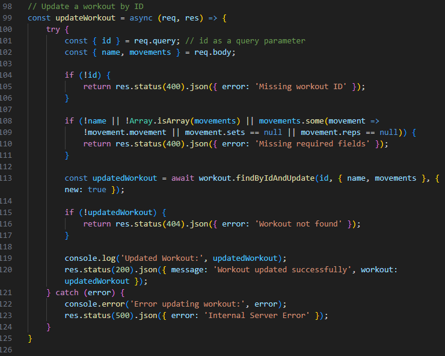

updateWorkout-funktio päivittää tehdyn saaduilla tiedoilla

## harjoitepohja controller

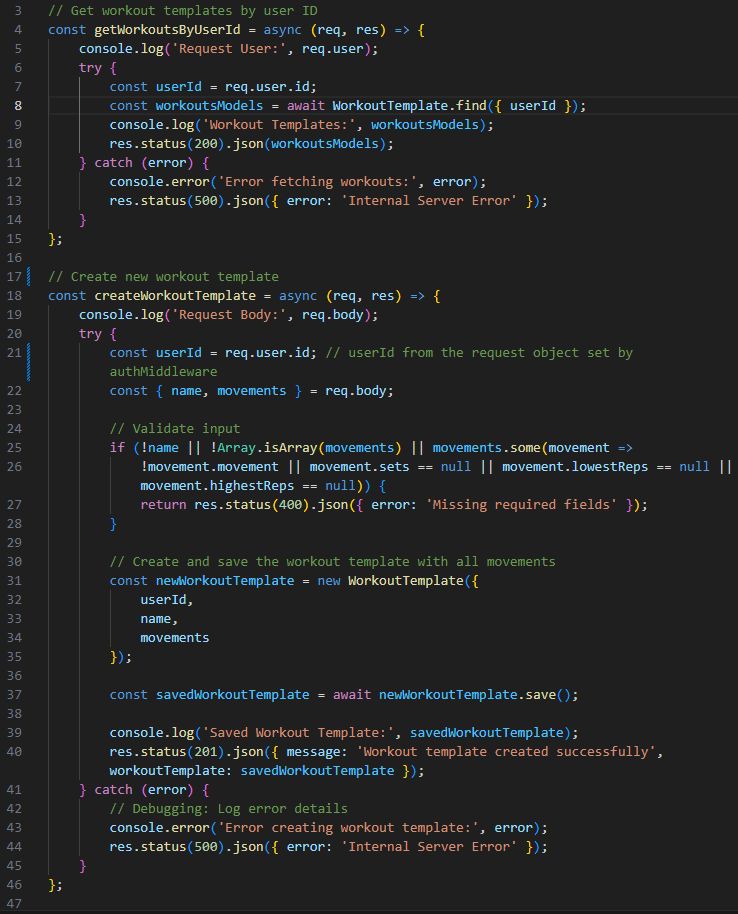

getWorkoutsByUserId-funktio hakee kaikki tehdyt harjoitteet käyttäjäIdn perusteella

createWorkoutTemplate-funktio luo uuden harjoitepohjan saatujen tietojen perusteella

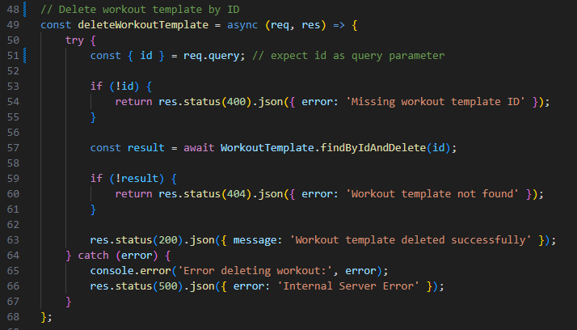

deleteWorkoutTemplate-funktio poistaa harjoitepohjan saadun idn perusteella

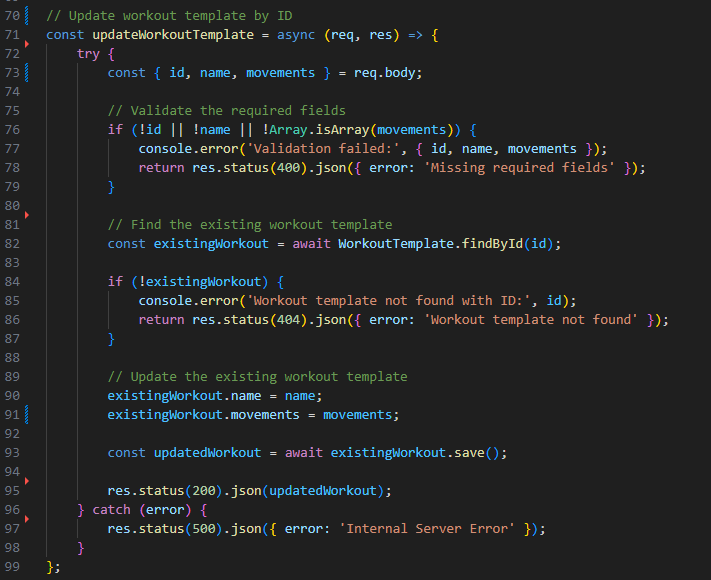

updateWorkoutTemplate-funktio päivittää harjoitepohjan saaduilla tiedoilla